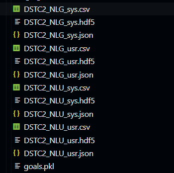
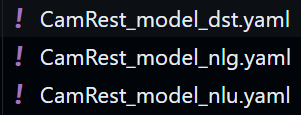

# TSI - Multi agent research dialogue system

To use the same methods as the researchers who posted the paper ------ , ------, ------. We used plato, developed by UberAI (which they work for).

## Installation w/ additional notes

To begin with the replication process we first need to create a environment with all the necessary packages in certain versions, and let me tell you - that was not easy to figure out!

Start by creating a fresh environment in python 3.6. We used anaconda, you may use python virtual environments if preferred.

```conda create -n plato python==3.6```

Then you need to install all required packages. Go to the plato-research-dialogue-system-master directory and run the following line:

```pip install -e .```

If there are any version conflicts, installing the lowest version present in requirements.txt should fix them.

For example: ```ludwig>=0.2.2``` -> ```pip install ludwig==0.2.2```

Tensorflow may also cause problems. So we recommend to try version 1.15, which should work fine.


## Replication

The main tutorial was not great, so let's dive deeper into each step we should take to train the multi agent system.

### Parsing the data

Go to https://github.com/matthen/dstc and download dstc2_traindev.tar.gz.

Then run the following command:

Go to `example/config/parser/Parse_DSTC2.yaml` and change the data_path to where you extracted the data mentioned above.

Then run:

```plato parse -config 'Parse_DSTC2.yaml'.```

If it doesn't work try with the full path to the yaml file:


```plato parse -config example/config/parser/Parse_DSTC2.yaml.```


Check the data folder to see if it worked. It should have created the following files:



### Creating NL models

By using ludwig, we can train NLU, NLG and DST separated.


#### NLG

```ludwig experiment --model_definition_file Examples/config/ludwig_nlg_train.yaml --data_csv Data/data/DSTC2_NLG_sys.csv --output_directory Models\CamRestNLG\Sys\```

This should create the NLG model in the directory present in the last argument.

```ludwig experiment --model_definition_file Examples/config/ludwig_nlg_train.yaml --data_csv Data/data/DSTC2_NLG_usr.csv --output_directory Models\CamRestNLG\Usr\```

^ to create nlg for the user too.

#### DST

```ludwig experiment --model_definition_file Examples/config/ludwig_dst_train.yaml --data_csv Data/data/DSTC2_DST_sys.csv --output_directory Models\CamRestDST\Sys\```

```ludwig experiment --model_definition_file Examples/config/ludwig_dst_train.yaml --data_csv Data/data/DSTC2_DST_usr.csv --output_directory Models\CamRestDST\Usr\```

#### NLU

Nlu was a real problem. After wasting a lot of time without knowing what was wrong, we thought to check the paper released date and noticed it was older than the recent commits. So we reverted back to a older commit and noticed it worked. The old commit directory is also in the repo, since we tested a lot of stuff in that version.

We concluded the problem was ludwig's version (they were using ludwig==0.1 back then). We tried with 0.2.1 and it worked without ruining anything some place else. Note that you must also lower the version in requirements.txt (we know this is not a good practice, but it fixed the problem and did not create new ones).

So, after downgrading ludwig, the following should work:

```ludwig experiment --model_definition_file Examples/config/ludwig_nlu_train.yaml --data_csv Data/data/DSTC2_NLU_sys.csv --output_directory Models\CamRestNLU\Sys\```

```ludwig experiment --model_definition_file Examples/config/ludwig_nlu_train.yaml --data_csv Data/data/DSTC2_NLU_usr.csv --output_directory Models\CamRestNLU\Usr\```


You can now run these configs individually to check if every language model is working properly:



### Multi Agent system

We can know finally train our agents! A multi-agent system configuration could already be found in example/config/application

We adapted it to use the trained NLP models and it can be found on the config directory.

To train the models, simply run:

```plato run --config config/MA_replicate_train.yaml```

And to test them, run:

```plato run --config config/MA_replicate_test.yaml```

Note: From what we could find in the old commit and by reading the paper, we noticed that no DST was used by the people who wrote the paper. This made sense, since only the recent plato version supports it. Therefore, following this steps may lead to better results than the original paper.