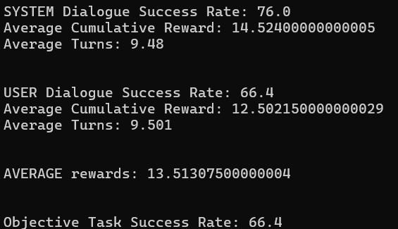
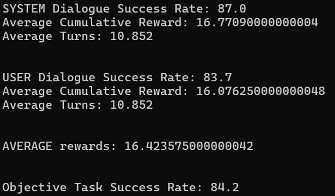

# TSI - Multi agent research dialogue system

To use the same methods as the researchers who posted the paper ------ , ------, ------. We used plato, developed by UberAI (which they work for).

## Installation w/ additional notes

To begin with the replication process we first need to create a environment with all the necessary packages in certain versions, and let me tell you - that was not easy to figure out!

Start by creating a fresh environment in python 3.6. We used anaconda, you may use python virtual environments if preferred.

```conda create -n plato python==3.6```

Then you need to install all required packages. Go to the plato-research-dialogue-system-master directory and run the following line:

```pip install -e .```

If there are any version conflicts, installing the lowest version present in requirements.txt should fix them.

For example: ```ludwig>=0.2.2``` -> ```pip install ludwig==0.2.2```

Tensorflow may also cause problems. So we recommend to try version 1.15, which should work fine.

> **Note:** Ludwig version 0.2.2 caused problems with the NLU training. We had to downgrade to 0.2.1 to make it work. 


## Replication

The main tutorial was not great, so let's dive deeper into each step we should take to train the multi agent system.

### Parsing the data

Go to https://github.com/matthen/dstc and download dstc2_traindev.tar.gz.

Then run the following command:

Go to `example/config/parser/Parse_DSTC2.yaml` and change the data_path to where you extracted the data mentioned above.

Then run:

```plato parse -config 'Parse_DSTC2.yaml'.```

If it doesn't work try with the full path to the yaml file:


```plato parse -config example/config/parser/Parse_DSTC2.yaml.```


Check the data folder to see if it worked. It should have created the following files:


### Creating NL models

By using ludwig, we can train NLU, NLG and DST separated.


#### NLG

```ludwig experiment --model_definition_file Examples/config/ludwig_nlg_train.yaml --data_csv Data/data/DSTC2_NLG_sys.csv --output_directory Models\CamRestNLG\Sys\```

This should create the NLG model in the directory present in the last argument.

```ludwig experiment --model_definition_file Examples/config/ludwig_nlg_train.yaml --data_csv Data/data/DSTC2_NLG_usr.csv --output_directory Models\CamRestNLG\Usr\```

^ to create nlg for the user too.

#### DST

When working with `DSTC2_DST_sys.csv` and `DSTC2_DST_usr.csv` for **Dialog State Tracking (DST)**, we encountered a slight structural difference between the two datasets, as they have **different features (column names)**. This required creating and using separate Ludwig configuration files (`.yaml`) to train the models effectively.

Initially, the provided configuration file `ludwig_dst_train.yaml` (changed to `ludwig_dst_train_sys.yaml`) was suitable for the **system dataset (`sys`)**, as it matched its specific features. However, when training the model with the **user dataset (`usr`)**, the configuration file needed modifications to reflect the different column structure. 

To solve this, we created a new configuration file called `ludwig_dst_train_usr.yaml`, which was tailored for the **user dataset**. This allowed successful training for both perspectives with the following commands:

- **For the system dataset (`sys`)**:
  ```bash
  ludwig experiment --model_definition_file Examples/config/ludwig_dst_train.yaml --data_csv Data/data/DSTC2_DST_sys.csv --output_directory Models\CamRestDST\Sys\
    ```

- **For the user dataset (`usr`)**:
    ```bash
    ludwig experiment --model_definition_file Examples/config/ludwig_dst_train_usr.yaml --data_csv Data/data/DSTC2_DST_usr.csv --output_directory Models\CamRestDST\Usr\
    ```

This ensures that both the system and user perspectives are accurately trained while accounting for their structural differences.

#### NLU

Nlu was a real problem. After wasting a lot of time without knowing what was wrong, we thought to check the paper released date and noticed it was older than the recent commits. So we reverted back to a older commit and noticed it worked. The old commit directory is also in the repo, since we tested a lot of stuff in that version.

We concluded the problem was ludwig's version (they were using ludwig==0.1 back then). We tried with 0.2.1 and it worked without ruining anything some place else. Note that you must also lower the version in requirements.txt (we know this is not a good practice, but it fixed the problem and did not create new ones).

So, after downgrading ludwig, the following should work:

```ludwig experiment --model_definition_file Examples/config/ludwig_nlu_train.yaml --data_csv Data/data/DSTC2_NLU_sys.csv --output_directory Models\CamRestNLU\Sys\```

```ludwig experiment --model_definition_file Examples/config/ludwig_nlu_train.yaml --data_csv Data/data/DSTC2_NLU_usr.csv --output_directory Models\CamRestNLU\Usr\```


You can now run these configs individually to check if every language model is working properly:


### Multi Agent system

We can know finally train our agents! A multi-agent system configuration could already be found in example/config/application

We tried adapting it to use the trained NLP models, however, this created many issues that we were not able to solve (despite several hours debugging). We believe it is a problem related to plato.

Instead of training the multi agent system with the NLP models, we used the default NLU and NLG - which do not need previous training of existing dialogues. This is actually more interisting to create agents acting on a new domain because it can be based on any database, and NLU and NLG require previously recorded dialogues to train each component.

We noticed that despite using the default version, our results were similar to the ones on the paper (which may indicate they also used the default NLP).

After training - by generating 20k dialogues - the multi agent system (with WolfPHC agents) from scratch, we then tested the agents on a new batch of 1000 dialogues (same as the paper). The results were the following: 



As can be seen above, the results were replicated.


## New domain

Now that we replicated the results, let's train agents on a new domain.

The first step was to choose the domain: we ended up with a dataset with Lisbon Airbnb data.

We then simplified it with simple pandas operations, as can be seen in directory notebooks.

### Create Ontology

Next, we created the ontology and a .db file with the csv data. To do so, we simply ran this:

plato domain --config "path/newdomain.yaml"

```yaml
GENERAL:
  csv_file_name: data/lisbon.csv
  db_table_name: lisbon
  db_file_path: domains/lisbon-dbase.db
  ontology_file_path: domains/lisbon-rules.json


ONTOLOGY:
  informable_slots: [price, type, town, name]

  requestable_slots: [price, town, type, name, rating, coordinates]

  system_requestable_slots: [price, type, town]
```

In the file, we simply need to indicate the csv path, and the directory in which to save the database and ontology file.

The ontology file consists of a json with rules related to each dataset variable.

The informable slots are features which the system informs the user, and may be set as a constraint (an example of a constraint would be the user wanting a cheap airbnb).

The requestable slots are slots that the user may want to ask the system (i.e. "What is the rating?").

System requestable slots are features the system may ask the user for their preference (i.e. "Which type would you like?").

### Training the agents

To then train the agents, we tried to run a similar config as the one used to replicate the original results. However, we noticed that even the default NLPs and policies were kinda hard-coded and only worked with the Cambridge domain. After debugging (a lot) we managed to adapt it to work with any domain and, after running the same process mentioned before, we got the following results:



We were a bit surprised by the results, which we were a lot better for the new domain. Since we used the same process for both domains, this improvement in results happened due to the fact that the new dataset is simpler.


